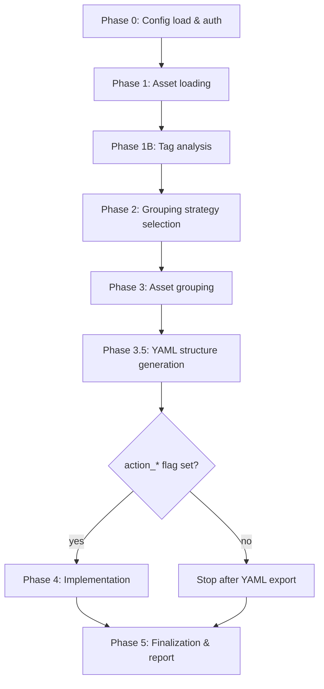

# Autogroup - Complete Reference

The autogroup pipeline (`providers/autogroup_orchestrator.py` +
`providers/AutoGroupEngine.py`) ingests Phoenix asset inventory and emits
production-grade `core-structure-*.yaml` files that PYRUS can upload to
create applications, components, environments, and services in one batch.

This single document covers both operator usage and engineering internals.

---

## Part A. Operator guide

### A.1 Folder layout

Every invocation creates one timestamped subfolder under `autogroup-output/`:

```
autogroup-output/
├── docs/AUTOGROUP.md               # this file (tracked)
├── examples/                       # self-contained offline fixture + config (tracked)
│   ├── README.md
│   ├── autogroup-config.example.yaml
│   └── synthetic-assets.json
├── .cache/                         # tag-analysis content-hash cache (local-only, safe to delete)
└── <YYYYMMDD_HHMMSS>/              # one folder per autogroup invocation (local-only)
    ├── tag-analysis-*.json         # tag-coverage report (Phase 1B output)
    ├── grouping-plan-*.yaml        # intermediate grouping plan (Phase 3)
    ├── core-structure-*.yaml       # the schema-shaped YAML you upload via PYRUS
    ├── created-components-*.yaml   # summary of what implementation created
    ├── execution-report-*.json     # phase timings, counts, errors
    ├── terminal.log                # full autogroup console output (phases 0–5)
    ├── autogroup.log               # structured JSON audit log (machine-parseable)
    └── checkpoints/
        ├── checkpoint-01-tag-analysis.json
        ├── checkpoint-02-grouping-plan.yaml
        └── checkpoint-03-execution-log.json
```

Run folders are **never auto-pruned**. Delete old ones manually when you no
longer need them. Everything inside `autogroup-output/` except `docs/` and
`examples/` is local-only and excluded from version control via `.gitignore`.
The `.cache/` folder holds the tag-analysis content-hash cache (used to skip
re-analysis on identical asset sets) and can be wiped at any time.

### A.2 Identifying a healthy run

Open `execution-report-*.json` and look for:

```json
"statistics": {
  "total_assets": <non-zero>,
  "groups_created": <non-zero>,
  ...
}
```

If both numbers are zero, the run produced nothing - check the console output
for `Refusing to resume from empty checkpoint` or `0 assets loaded`.

`autogroup.log` is a JSON-lines audit trail. One `phase_complete` line per
phase:

```json
{"ts":"2026-05-27T14:32:30.564422Z","level":"INFO","event":"phase_complete",
 "phase":"grouping","duration_s":0.0004,"input_count":15,"output_count":5,
 "details":{"status":"success","tagged":2,"untagged":3}}
```

### A.3 Terminal log capture (like batch-upload)

Two logs are written per run:

| File | What it captures |
|---|---|
| `<run>/terminal.log` | All autogroup phase output (`print()` from the orchestrator and engine). Enabled by default via `output.capture_terminal_log: true`. |
| `autogroup-output/run-logs/autogroup_<ts>.log` | **Full** `run-phx.py` session (autogroup banner, final execution report, etc.) when you use the wrapper script below. |

**Wrapper (recommended for API runs you want to archive):**

```bash
set -a && source ./local.env && set +a
./autogroup-output/run-autogroup.sh "$CLIENT_ID" "$CLIENT_SECRET" \
  --api_domain "$api_domain_demo2" \
  --action_autogroup=true
```

Same idea as `batch-upload/upload-logs/*_upload.txt` — output streams through `tee` to disk as the run proceeds.

### A.4 CLI usage matrix

| Goal | Command |
|---|---|
| Generate only (review YAML, no platform writes) | `python run-phx.py --action_autogroup true --autogroup_mode batch --autogroup_config origin/autogroup-config.yaml --client_id "<ID>" --client_secret "<SECRET>" --api_domain https://api.<tenant>.securityphoenix.cloud` |
| Generate + implement code components | add `--action_code true` |
| Generate + implement cloud components | add `--action_cloud true` |
| Generate + create teams | add `--action_teams true` |
| Full pipeline | add `--action_teams true --action_code true --action_cloud true` |
| File mode (offline) | add `--autogroup_asset_source file --autogroup_asset_file autogroup-output/examples/synthetic-assets.json` |
| Custom output folder | add `--autogroup_output_dir /tmp/my-run` |
| Interactive (prompt on resume) | `--autogroup_mode interactive` |

Relative paths passed to `--autogroup_output_dir` are resolved from the repo
root. Default output root is `autogroup-output/`.

### A.5 Re-running from a previous checkpoint

By default, the most recent prior run is the resume source. To target a
specific run, set the autogroup config's `output.base_dir` to point at that
run's parent and remove any newer timestamped folders, then re-invoke. (A
cleaner `--autogroup_resume_from <path>` flag may land in a future update.)

### A.6 What lives where

| Location | Purpose |
|---|---|
| `Resources/origin/autogroup-config.yaml` | Inputs: configuration teams curate. Version-controlled. |
| `Resources/origin/autogroup-config-GUIDED-TEMPLATE.yaml` | Inputs: pristine template. Version-controlled. |
| `autogroup-output/<run>/` | Outputs: artifacts from each invocation. Local-only. |
| `autogroup-output/docs/` | This documentation. Version-controlled. |

### A.7 Understanding tag analysis

**What it is**

Tag analysis is Phase 1B of every autogroup run. After loading all assets from
Phoenix, the engine scans every tag across every asset and builds a coverage
report — how many assets carry each tag key, what the unique values are, and
which values appear most often. This report is what the engine uses in Phase 2
to decide *which tag to group by* (e.g. `Application`, `Team`, `aws:cloudformation:stack-name`).

**What low coverage means in practice**

Most real tenants have low tag coverage. For example:

```
total_assets: 485
assets_with_tags: 46
tag_coverage_percent: 9.5%
```

Only 9.5% of assets tagged means 90% of the inventory has no tags at all.
Autogroup handles this gracefully — tagged assets get grouped by tag, while
untagged ones fall into fallback buckets (grouped by CIDR for INFRA, image
name for containers, hostname similarity for bare-metal, etc.). The resulting
`core-structure.yaml` will still be usable, but component names for untagged
assets are less meaningful. The fix is upstream: improve tag hygiene in your
IaC or CMDB so more assets carry an `Application` or `Team` tag before running
autogroup.

**Reading a tag analysis file**

Each entry in `tags_by_coverage` tells you:

| Field | Meaning |
|---|---|
| `key` | The tag key (e.g. `Application`, `aws:cloudformation:stack-name`) |
| `asset_count` | How many assets carry this tag |
| `coverage_percent` | `asset_count / total_assets * 100` |
| `unique_values` | How many distinct values exist for this tag |
| `most_common_values` | Top values and how many assets carry each |

The tag with the highest `coverage_percent` that maps to a semantic concept
(application, team, environment) in your `tag_mapping.mappings` config becomes
the primary grouping tag.

**The `.cache/` folder**

Re-computing tag analysis on large tenants (5000+ assets) takes time.
The engine hashes the entire asset set and stores the result in
`.cache/tag-analysis/tag-analysis-<hash>.json`. On subsequent runs, if the
assets haven't changed, the cached result is loaded instantly instead of
recomputing. The hash changes automatically whenever any asset is added,
removed, or has a tag updated — so you never see stale results.

The cache is safe to delete at any time. The next run will recompute and
repopulate it.

---

## Part B. Engineering reference

### B.1 Architecture - the 5 phases



| Phase | Owner | Inputs | Outputs |
|---|---|---|---|
| 0 | `run_autogroup` | `config_path`, `client_id`, `client_secret` | resolved config, auth token, `run_dir` |
| 1 | `fetch_assets_from_api` / `load_assets_from_file` | API or JSON fixture | `assets: List[Dict]` |
| 1B | `TagAnalyzer.analyze` | `assets` | `tag_analysis: Dict` (coverage, top tags) |
| 2 | `TagAnalyzer.recommend_grouping_tags` + heuristics | `tag_analysis`, config | `primary_tag`, `secondary_tag` |
| 3 | `AssetGrouper.group_by_tags` + fallback strategies | tagged + untagged assets | `tagged_groups`, `untagged_groups` |
| 3.5 | `generate_standard_yaml_structure` | grouping plan | `core-structure-*.yaml` |
| 4 | YAML ingestion via existing PYRUS providers (`populate_applications_from_config`, `populate_environments_from_env_groups_from_config`, `populate_teams`) | YAML + action flags | created teams/apps/components/envs/services |
| 5 | inline | results dict | `execution-report-*.json`, `created-components-*.yaml` |

### B.2 Asset data model

| Field | Type | Source | Notes |
|---|---|---|---|
| `assetName` | string | Phoenix API | Required - used as fallback identifier |
| `type` | enum | Phoenix API | CLOUD / CONTAINER / INFRA / REPOSITORY / SOURCE_CODE / BUILD / FOSS / SAST / WEB / WEBSITE_API |
| `tags` | `List[{key, value}]` | Phoenix API | Source of truth for grouping |
| `cloudProvider` | string | Phoenix API (CLOUD) | AWS / Azure / GCP |
| `account` | string | Phoenix API (CLOUD) | Provider account ID |
| `region` | string | Phoenix API (CLOUD) | Optional |
| `ip` | string | Phoenix API (INFRA) | Used for CIDR fallback (default /24) |
| `hostname` | string | Phoenix API (INFRA) | Used for Levenshtein fallback |
| `imageName` | string | Phoenix API (CONTAINER) | Used for container name grouping |
| `repository` | string | Phoenix API (REPOSITORY) | Used for repo grouping |

Autogroup is read-only on assets. It never writes back to Phoenix - tag
creation/updates are out of scope.

### B.3 Emitted YAML schema

Two top-level lists, matching the standard `core-structure-*.yaml` shape
that PYRUS uploads accept.

#### DeploymentGroups (Applications)

```yaml
DeploymentGroups:
- AppName: Checkout
  BU: Payments
  Status: production
  ReleaseDefinitions: []
  Responsable: ops@example.com
  Tier: 5
  Tags_label:
  - Checkout
  Tag_label: []
  Deployment_set: checkout
  Components:
  - ComponentName: Checkout-checkout-team-repository
    Status: production
    Type: BUILD
    Tier: 5
    Domain: checkout-prod
    SubDomain: checkout-prod
    TeamNames: [checkout-team]
    Deployment_set: checkout-team
    Tags_label:
    - 'ComponentType: service,backend'
    MULTI_MultiConditionRules:
    - Tag: 'Application: Checkout'
```

| App-level field | Source | Notes |
|---|---|---|
| `AppName` | primary tag value | Required |
| `BU` | `costcenter` tag (config-mapped), optionally suffixed via `defaults.bu_suffix` | |
| `Status` | `Status` / `Environment` tag, else `defaults.status` | |
| `ReleaseDefinitions` | always `[]` | Schema convention |
| `Responsable` | `defaults.responsable` | |
| `Tier` | `Tier`/`Criticality` tag, else `defaults.tier` | int |
| `Tags_label` | `[AppName]` | Schema convention |
| `Tag_label` | always `[]` | Schema convention |
| `Deployment_set` | slugified `AppName` | |

| Component-level field | Source | Notes |
|---|---|---|
| `ComponentName` | derived during grouping | App + team + asset_type bucket |
| `Status` | per-component tag or app default | |
| `Type` | `_derive_component_type(asset_type)` | BUILD for code, Release for web |
| `Tier` | per-component or app default | |
| `Domain` / `SubDomain` | slug(AppName) + status shortname | E.g. `checkout-prod` |
| `TeamNames` | from secondary tag (e.g. `Team`) | List |
| `Deployment_set` | slug(component) | |
| `Tags_label` | `Environment: X`, `ComponentType: Y`, `productowner:Z` | |
| `MULTI_MultiConditionRules` | **list** of 1+ rule dicts | Crucial: list, not singular |

#### EnvironmentGroups (Environments)

Same shape, but with `Name` / `Services` instead of `AppName` / `Components`,
and `TeamName` (singular) on each service.

#### Rule shape (inside MULTI_MultiConditionRules)

`_generate_multi_condition_rule` picks the most specific filter for the
group's grouping_method:

| `grouping_method` | Emitted rule |
|---|---|
| `tag` | `{Tag: "Application: Checkout"}` |
| `cidr` | `{Cidr: "10.22.3.0/24"}` |
| `hostname` | `{Hostnames: ["...", "..."]}` |
| `repository` | `{RepositoryName: "acme/checkout"}` |
| `cloud_provider` | `{ProviderAccountId: ["123..."], AssetType: "CLOUD"}` |
| `image_name` | `{SearchName: "checkout-api:1.4", AssetType: "CONTAINER"}` |
| `type` | `{AssetType: "INFRA"}` |
| fallback | `{SearchName: <cleaned component name>}` |

### B.4 Tag-mapping configuration

`tag_mapping.mappings` in the config tells autogroup which **asset tag keys**
map to which **semantic concepts**:

```yaml
tag_mapping:
  mappings:
    application: [Application, application, app, service]
    team:        [Team, team, owner, responsible]
    costcenter:  [CostCenter, BU, business_unit, Department]
    environment: [Environment, environment, env, Name]
```

The order of keys per concept defines the lookup priority. The first matching
tag wins.

These mappings drive:
- `_tag_keys_for(config, 'application')` -> primary grouping tag selection
- `_derive_bu()` -> App.BU
- `_derive_tags_label_component()` -> Component.Tags_label entries

To support a new tenant's tag taxonomy, edit only the lists - no code change.

### B.5 Optimisations applied

| Phase | Optimisation | Win |
|---|---|---|
| 1 | Concurrent API pagination | 5-10x on tenants with 5000+ assets |
| 1B | Tag analysis cache keyed on asset-set hash | Subsequent runs on identical input skip recompute |
| 3 | Prefix-bucketed Levenshtein in hostname / container name grouping | 10-50x on real INFRA inventories |
| 3.5 | Type-split on heterogeneous tag groups | Correctness fix: one group spanning CLOUD+REPOSITORY now lands in both DG and EG with correct routing |

Constants live in `providers/AutoGroupEngine.py` near the top of the file:
`BUCKET_PREFIX_LEN`, `DEFAULT_INFRA_CIDR_MASK`, `DEFAULT_API_PAGE_SIZE`,
`DEFAULT_API_MAX_CONCURRENCY`.

### B.6 Known limitations

- **No tag creation/update**: autogroup is read-only on the asset graph. Use
  upstream tag-hygiene tooling (IaC, CMDB sync, dedicated tagging jobs) to
  improve tag coverage at the source.
- **Requires healthy primary tagging**: assets without `Application`/`Team`
  tags fall into infra/cloud/container fallback buckets that produce less
  meaningful component names. Improve tag coverage in the source-of-truth
  (CMDB / IaC) for the best results.
- **Single-tenant per invocation**: pass one `--api_domain` per run. To
  process multiple tenants, run the command N times with N config files
  and N output dirs.
- **No interactive group editing**: the grouping plan is fully driven by
  config + tags. To override individual groups, hand-edit the
  `core-structure-*.yaml` after the run.

### B.7 Adding a new field to the emitted YAML

Touchpoints (typical order):
1. Add the value derivation to a `_derive_*` helper in
   `providers/AutoGroupEngine.py` (above `export_to_yaml`).
2. Insert the field into the right dict literal inside
   `generate_standard_yaml_structure`: the `app_group = {...}` literal
   (App-level), `component = {...}` (Component-level), `env_group = {...}`
   (Environment-level), or `service = {...}` (Service-level).
3. Update the schema parity test
   (`tests/autogroup/test_yaml_schema_parity.py`) to assert the new field
   is emitted.
4. Update Section B.3 of this document.
5. Update both GUIDED templates if the field has a config-driven default.

### B.8 Adding a new grouping method

1. Set `metadata['grouping_method'] = 'foo'` on the group dict during
   `AssetGrouper`.
2. Add a branch in `_generate_multi_condition_rule` that emits the
   appropriate Phoenix filter for `'foo'`.
3. Add a fixture covering the new method in
   `autogroup-output/examples/synthetic-assets.json` and re-run the parity test.

### B.9 Debugging matrix

| Symptom | Likely cause |
|---|---|
| Empty `core-structure-*.yaml` (only `AllAccessAccounts`) | Stale empty checkpoint (now blocked - see `Refusing to resume from empty checkpoint` warning) |
| `AutogroupEmptyResultError` at Phase 1 | Auth failed, wrong `--api_domain`, or `onlyUnassigned` excludes everything |
| `AutogroupEmptyResultError` at Phase 3 | `min_assets_per_component` too high, or no assets carry the configured primary tag |
| All components land in EnvironmentGroups | Configured `deployment_group_types` doesn't include your code asset type. Verify `yaml_generation.asset_routing.deployment_group_types`. |
| Wrong BU values | `tag_mapping.mappings.costcenter` doesn't list the tag key your assets actually carry |
